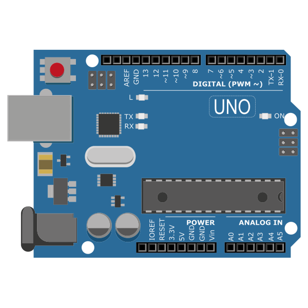
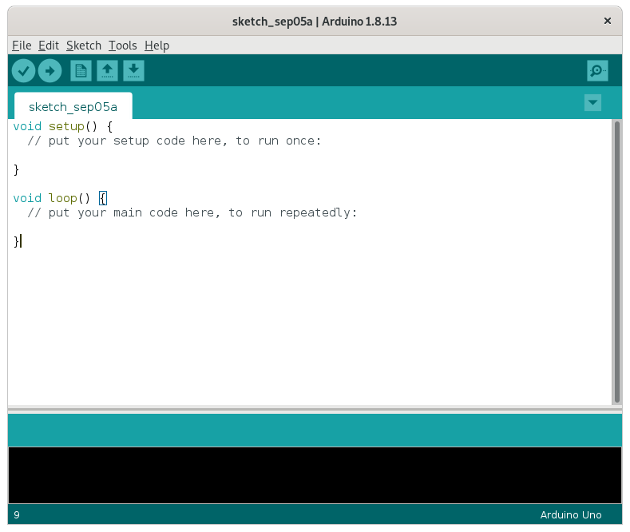
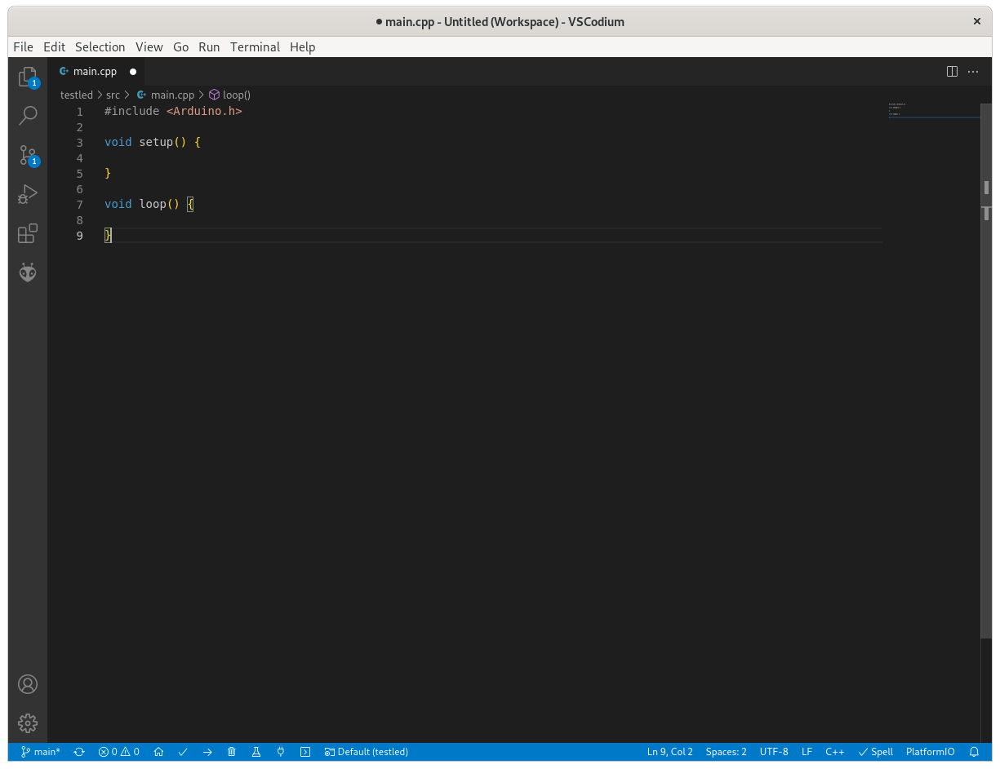
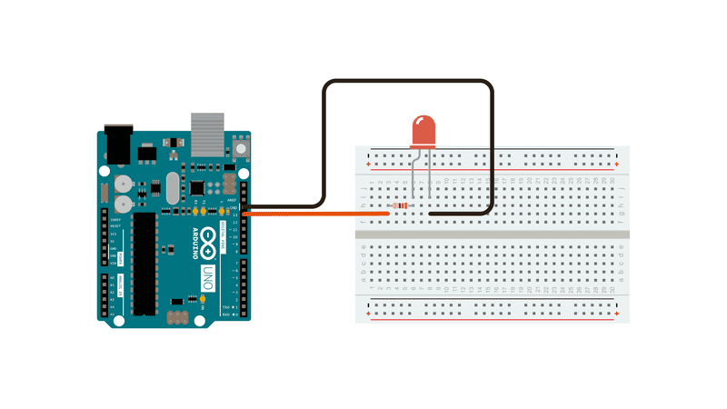

<!--
author: "Pablo Moreira"
theme: default
paginate: true
size: 16:9
footer: "[Link](https://github.com/pablomoreira/arduino_01/blob/main/clase01.md)"
-->

<style>
r { color: Red }
o { color: Orange }
g { color: Green }
</style> 

# **ARDUINO**

- # Introducción
- # IDE [Descarga](https://www.arduino.cc/en/software)
- # IDE [Alternativo](https://platformio.org/)

<!-- Que es Arduino Placas Bibliotecas IDE Libre 
    ¿Quien sabe programar o usado lenguajes de programación?
    ¿Conocen las estructuras básica de un lenguaje estructurado?
    Que es C y porque se utiliza para programar micros
    Como funciona una cpu
    Diferencias entre un Procesador y un micro
    Multi procesos 
    Multi tareas 

 -->

---

# **ARDUINO IDE**


---

# **ARDUINO IDE ALTERNATIVO**



---
# **CÓDIGO**

```cpp
#include <Arduino.h>

void setup() {
  
}

void loop() {
  
}
```

---
[](https://www.youtube.com/embed/ivPv_kaYuwk)

---


---

# **Variables Numéricas**
- ## <r>byte</r>  A byte stores an 8-bit unsigned number, from 0 to 255
- ## <r>char</r> A data type used to store a character value. Character literals are written in single quotes, like this: 'A'
- ## <r>float</r> Datatype for floating-point numbers, a number that has a decimal point. Floating-point numbers are often used to approximate analog and continuous values because they have greater resolution than integers. Floating-point numbers can be as large as 3.4028235E+38 and as low as -3.4028235E+38. They are stored as 32 bits (4 bytes) of information.
---
- ## <r>double</r> Double precision floating point number. On the Uno and other ATMEGA based boards, this occupies 4 bytes. That is, the double implementation is exactly the same as the float, with no gain in precision
- ## <r>int</r> On the Arduino Uno (and other ATmega based boards) an int stores a 16-bit (2-byte) value. This yields a range of -32,768 to 32,767 (minimum value of -2^15 and a maximum value of (2^15) - 1). On the Arduino Due and SAMD based boards (like MKR1000 and Zero), an int stores a 32-bit (4-byte) value. This yields a range of -2,147,483,648 to 2,147,483,647 (minimum value of -2^31 and a maximum value of (2^31) - 1).
---
- ## <r>long</r> Long variables are extended size variables for number storage, and store 32 bits (4 bytes), from -2,147,483,648 to 2,147,483,647.
- ## <r>short</r> A short is a 16-bit data-type. On all Arduinos (ATMega and ARM based) a short stores a 16-bit (2-byte) value. This yields a range of -32,768 to 32,767 (minimum value of -2^15 and a maximum value of (2^15) - 1).
---
# **Funciones**
Porción de código que realiza un proceso independiente del programa principal

Su principal objetivo es fragmentar el código con la idea de que un problema puede dividirse en sub problemas mas simples.

```cpp
void func1(){

} 
int func2(){

}
```
---
# En resumen se puede entender una función como una caja negra con flujo de datos de entrada y salida.

---

# Hola Mundo (Blink)

```cpp
byte LED = 13;
void setup() {
  pinMode(LED, OUTPUT);
}

void loop() {
  digitalWrite(LED, HIGH);   // turn the LED on (HIGH is the voltage level)
  delay(1000);                       // wait for a second
  digitalWrite(LED, LOW);    // turn the LED off by making the voltage LOW
  delay(1000);                       // wait for a second
}
```
---


---

# **Estructuras de control o decisión <g>IF (SI)</g>**

```cpp
if (/* condition */)
{
  /* code */
}
else
{
  /* code */
}
```

---

```cpp
byte LED = 13;
byte var = 0;
void setup() {
  pinMode(LED, OUTPUT);
}
//Activar el led 10 veces
void loop() {
  if (var < 10){
    digitalWrite(LED, HIGH);   
    delay(1000);
    digitalWrite(LED, LOW);    
    delay(1000);
    var = var + 1;
  }                      
}

```

---

```cpp
byte LED = 13;
byte var = 0;
void setup() {
  pinMode(LED, OUTPUT);
}
//Luego de Activar 10 veces cambiar la velocidad del blink
void loop() {
  if (var < 10){
    digitalWrite(LED, HIGH);   
    delay(1000);
    digitalWrite(LED, LOW);    
    delay(1000);
    var = var + 1;
  }else{
    digitalWrite(LED, HIGH);   
    delay(250);
    digitalWrite(LED, LOW);    
    delay(250);
  }                      
}
```

---
# **Estructuras repetitivas <g>FOR y WHILE</g>**

```cpp
byte LED = 13;
byte var = 0;
void setup() {
  pinMode(LED, OUTPUT);
}

void loop() {
  for(int i = 0; i < 10; i++){
    digitalWrite(LED, HIGH);   
    delay(250);
    digitalWrite(LED, LOW);    
    delay(250);
  }
  delay(5000);      
}
```

---
```cpp
byte LED = 13;
byte var = 0;
void setup() {
  pinMode(LED, OUTPUT);
}

void loop() {
  int = 0;
  while(i < 10){
    digitalWrite(LED, HIGH);   
    delay(250);
    digitalWrite(LED, LOW);    
    delay(250);
    i++;
  }
  delay(5000);      
}
```
---
# Problema 1
Conectar otro led a una salida digital y alternar los estados, cuando uno esté Activado (1 o HIGH) el otro debe estar LOW o 0.

---

Solución (Posible)1

```cpp
byte LED1 = 13;
byte LED2 = 12;
void setup() {
  pinMode(LED1, OUTPUT);
  pinMode(LED2, OUTPUT);
  digitalWrite(LED1, HIGH);
  digitalWrite(LED2, LOW);
}

void loop() {
  digitalWrite(LED1, HIGH);
  digitalWrite(LED2, LOW);
  delay(1000);
  digitalWrite(LED2, HIGH);
  digitalWrite(LED1, LOW);
  delay(1000);
}
```

---
Solución (Posible)2
```cpp
byte LED1 = 13;
byte LED2 = 12;
bool estado1 = HIGH;
bool estado2 = LOW;

void setup() {
  pinMode(LED1, OUTPUT);
  pinMode(LED2, OUTPUT);
  digitalWrite(LED1, HIGH);
  digitalWrite(LED2, LOW);
}

void loop() { 
   digitalWrite(LED1,!estado1);
   estado1 = !estado1;
   digitalWrite(LED2,!estado2);
   estado2 = !estado2;
   delay(1000);
}
```

---
Solucion (Posible3)
```cpp
byte LED1 = 13;
byte LED2 = 12;
bool estado = HIGH;

void setup() {
  pinMode(LED1, OUTPUT);
  pinMode(LED2, OUTPUT);
}

void loop() { 
   digitalWrite(LED1,!estado);
   digitalWrite(LED2,estado);
   estado = !estado;
   delay(1000);
}
```
