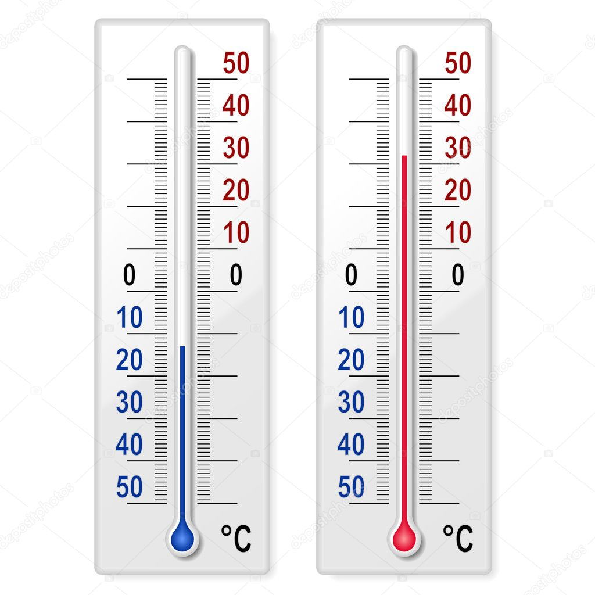
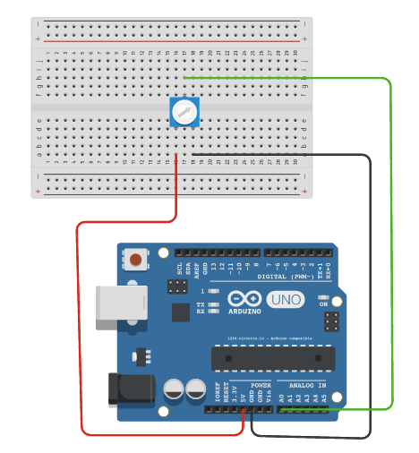
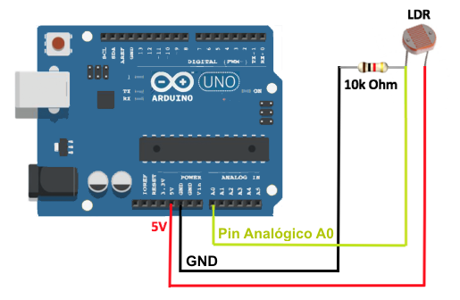
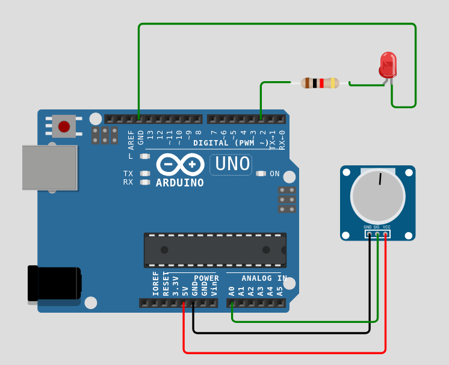
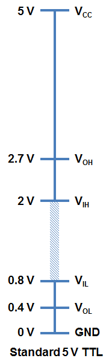
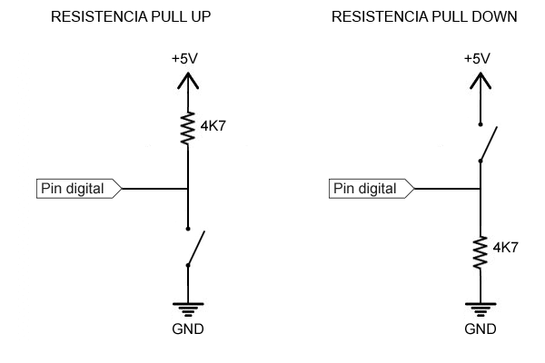
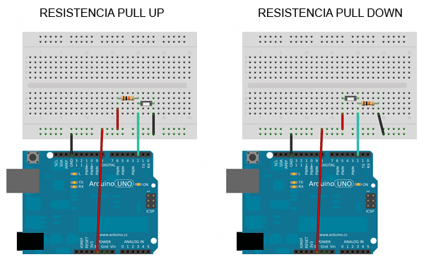

<!--
author: "Pablo Moreira"
theme: default
paginate: true
size: 16:9
footer: "[Link](https://github.com/pablomoreira/arduino_01/blob/main/clase01.md)"


-->

<style>
r { color: Red }
o { color: Orange }
g { color: Green }
</style> 

# **Clase 2 (Entradas Analógicas/Digitales)**
- Entradas Analógicas
- Lectura de sensor Analógicos
- Circuito con potenciómetros
- Circuito para una LDR
- Entradas Digitales
- Teclados matriciales
---
# **Analogías**

- La  *temperatura* es una magnitud física que indica la energía interna de un cuerpo, medida por un termómetro.


---

# **Termómetros de Mercurio (Galio)**


- Se mide observando la escala

---

# **Entradas Analógicos**


- Los Sensores analógicos tienen salidas que se pueden conectar a microprocesadores (Arduino)

- La analogía se hace con valores de voltage.

- Por ejemplo:  
    - 1 Volt  equivale a 10 <span>&deg;</span> Centígrados

---

#  **Potenciómetro como entrada analógica**



Convierte valores analógicos a digitales de 10-bit


---


| int    | Volts    |
|:-:|:-:|
|0  | 0.0000 - 0.0049|
|1  | 0.0049 -  0.0098|
|2  | 0.0098 - 0.0146|
|3  | 0.0146 - 0.0195|
|1022  | 4.9902 - 4.9951|
|1023  | 4.9951 - 5.0000|


---
# **Ejercicio Práctico 1.0**


```cpp
void setup() {
  Serial.begin(9600);
}

void loop() {
  Serial.println(analogRead(A0)); 
}
```

---
# **Ejercicio Práctico 1.1**

```cpp
void setup() {
  Serial.begin(9600); //
}
void loop() {
  uint16_t analog0;
  analog0 = analogRead(A0);
  Serial.println(analog0); 
  delay(1000);
}
```
---

# Fotorresistor

- componente electrónico cuya resistencia se modifica, con el aumento de intensidad de luz incidente.
- LDR (light-dependent resistor) 
---
# **Problema 1**

> Armar un circuito que simule o imite el funcionamiento de una lampara de iluminación callejera.
> - Cuando el sensor o LDR detecte falta de luz se active un led. 

---



```cpp
byte LED = 2;

void setup() {
  Serial.begin(9600);
  pinMode(LED, OUTPUT);
}

void loop() {
  uint16_t analog0;
  analog0 = analogRead(A0);
  Serial.println(analog0); 
  if(analog0 > 550){
    digitalWrite(LED, HIGH);
  }
  else{
    digitalWrite(LED, LOW);
  }
  delay(500);
}
```
---

# **Entradas Digitales**



> Estados *Altos* y *bajos*
> Lógicos *Verdadero* o *Falso*
> Binario *0* o *1*

La idea es tener dos estados bien diferenciados  

---
# **Circuito eléctricos**


---


---
```cpp
const int inputPin = 2;

int value = 0;
 
void setup() {
  Serial.begin(9600);
  pinMode(inputPin, INPUT);
}
 
void loop(){
  value = digitalRead(inputPin);  //lectura digital de pin
 
  //mandar mensaje a puerto serie en función del valor leido
  if (value == HIGH) {
      Serial.println("Encendido");
  }
  else {
      Serial.println("Apagado");
  }
  delay(1000);
}

```
---
## Problema 2
> Armar un circuito que simule o imite el funcionamiento de una lampara de iluminación callejera.
> - Cuando el sensor o LDR detecte falta de luz se active un led pero que al activar o presionar un pulsador se mantenga el estado actual sin importar la luz que reciba la LDR.