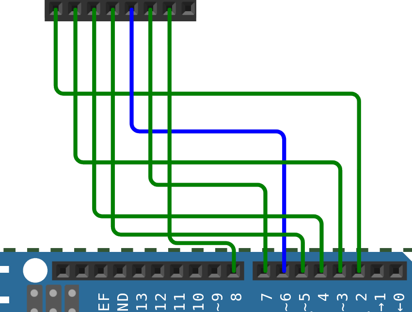

<!--
author: "Pablo Moreira"
theme: default
paginate: true
size: 16:9
footer: "[Link](https://github.com/pablomoreira/arduino_01/blob/main/clase03.md)"


-->
<style>
r { color: Red }
o { color: Orange }
g { color: Green }
</style> 

# Clase 3 (<g>Comunicaciones</g>)
- Comunicación serie (UART) 
- Lectura y Escritura del puerto serie.
- Display  LCD (2x16)
- Practica LCD + LDR
- Practica Teclados + LCD
---
# Comunicación serie (UART) 
<p align="center">
  
</p>

---
## **Transmisión Recepción Asíncrona Universal(UART)**

<p align="center">
  
</p>

---

## **Puente USB a UART**


<p align="center">
  
</p>

---
<p align="center">
  
</p>

---
## **Ejercicio practico puerto serie 1.0**   
> Escribir un programa que utilice el puerto serie para enviar información a Arduino. Si la placa recibe un **1** se <r>active</r> un led y si recibe un **0** lo <r>apague</r>.   
---
#

```cpp
// Transmitir y recibir datos por el puerto Serie 
byte LED1 = 12;

void setup() {
  Serial.begin(9600);               // Configuración de la velocidad
  pinMode(LED1, OUTPUT);
  Serial.println("Start");          // Enviar por la UART Start
}

void loop() {
if (Serial.available()){            // Hay un dato?
  char c  = Serial.read();          // Leer el dato 
  if (c == '0'){                    // Si el dato es un 0?
    digitalWrite(LED1, LOW);
    Serial.println("LED OFF");
  }else if(c == '1'){               // Si el dato es un 1?
        digitalWrite(LED1, HIGH);
        Serial.println("LED ON");
    }
  } 
}
```
---
## **Ejercicio practico puerto serie 1.1**
> Escribir un programa que utilice el puerto serie para enviar información a Arduino. Si la placa recibe un 1 se active un led y si recibe un 0 lo apague.
Hay que tener en cuenta que si el Led está activo y recibe un 1 no se debe informar ni ejecutar acción.

## Estructura IF con 2 condiciones lógicas
```cpp

if (c == 0 && estado == HIGH){

}
else{

}

```
---
## **Display LCD (2x16)**

<p align="center">
  
</p>

---

## **Comunicación serie I2C**

<p align="center">
  
</p>

---
## **Bibliotecas**
<p align="center">
  
</p>

---
## **Bibliotecas**
<p align="center">
  
</p>

---

```cpp
#include <LiquidCrystal_I2C.h>
byte contador = 0;
LiquidCrystal_I2C lcd(0x27,16,2);

void setup() {
  lcd.init();
  lcd.backlight();
}


void loop() {
  lcd.clear();
  lcd.print(contador);
  contador++;
  delay(500);
}
```
---
## **Ejercicio práctico 1**
> Escribir un programa que lea valores analógicos de un circuito con una LDR y muestre las lecturas en un display conectado por I2C.

---
```cpp
#include <LiquidCrystal_I2C.h>
LiquidCrystal_I2C lcd(0x27,16,2);
void setup() {
  lcd.init();
  lcd.backlight();
}

void loop() {
  uint16_t analog0;
  analog0 = analogRead(A0);
  lcd.clear();
  lcd.print(analog0);
  delay(200);
} 
```
---
## **Teclados Matriciales**
<p align="center">
  
</p>

---

## **Esquema 1**


*Abierto*
| 2 | 6 |
|:-:|:-:|
|0 |1|
|1 |1|

*Cerrado*
| 2 | 6 |
|:-:|:-:|
|0 |0|
|1 |1|

---

```cpp
byte F1 = 2;
byte C1 = 6;
void setup() {
  Serial.begin(9600);
  pinMode(F1, OUTPUT);
  pinMode(C1, INPUT_PULLUP);
  digitalWrite(F1, HIGH);
  
}
void loop() {
  
  digitalWrite(F1, LOW);
  Serial.println(digitalRead(C1));
  digitalWrite(F1, HIGH);
  delay(500);
}

```
---


---

```cpp
byte F1 = 2;
byte F2 = 3;
byte F3 = 4;
byte F4 = 5;
byte C1 = 6;
void setup() {
  // put your setup code here, to run once:
  Serial.begin(9600);
  pinMode(F1, OUTPUT);
  pinMode(F2, OUTPUT);
  pinMode(F3, OUTPUT);
  pinMode(F4, OUTPUT);
  pinMode(C1, INPUT_PULLUP);
  digitalWrite(F1, HIGH);
  digitalWrite(F2, HIGH);
  digitalWrite(F3, HIGH);
  digitalWrite(F4, HIGH);
}

void loop() {
  
  digitalWrite(F1, LOW);
  if (digitalRead(C1) == LOW) Serial.println("F1 C1");
  digitalWrite(F1, HIGH);
  
  digitalWrite(F2, LOW);
  if (digitalRead(C1) == LOW) Serial.println("F2 C1");
  digitalWrite(F2, HIGH);
  
  digitalWrite(F3, LOW);
  if (digitalRead(C1) == LOW) Serial.println("F3 C1");
  digitalWrite(F3, HIGH);
    
  digitalWrite(F4, LOW);
  if (digitalRead(C1) == LOW) Serial.println("F4 C1");
  digitalWrite(F4, HIGH);
  
  delay(120);
}
```
---


---
```cpp
byte F1 = 2;
byte F2 = 3;
byte F3 = 4;
byte F4 = 5;

byte C1 = 6;
byte C2 = 7;
byte C3 = 8;

void setup() {
  // put your setup code here, to run once:
  Serial.begin(9600);
  pinMode(F1, OUTPUT);
  pinMode(F2, OUTPUT);
  pinMode(F3, OUTPUT);
  pinMode(F4, OUTPUT);
  pinMode(C1, INPUT_PULLUP);
  pinMode(C2, INPUT_PULLUP);
  pinMode(C3, INPUT_PULLUP);
  
  digitalWrite(F1, HIGH);
  digitalWrite(F2, HIGH);
  digitalWrite(F3, HIGH);
  digitalWrite(F4, HIGH);

}

void loop() {
  
  digitalWrite(F1, LOW);
  if (digitalRead(C1) == LOW) Serial.println("F1 C1");
  if (digitalRead(C2) == LOW) Serial.println("F1 C2");
  if (digitalRead(C3) == LOW) Serial.println("F1 C3");
  digitalWrite(F1, HIGH);
  
  digitalWrite(F2, LOW);
  if (digitalRead(C1) == LOW) Serial.println("F2 C1");
  if (digitalRead(C2) == LOW) Serial.println("F2 C2");
  if (digitalRead(C3) == LOW) Serial.println("F2 C3");
  digitalWrite(F2, HIGH);
  
  digitalWrite(F3, LOW);
  if (digitalRead(C1) == LOW) Serial.println("F3 C1");
  if (digitalRead(C2) == LOW) Serial.println("F3 C2");
  if (digitalRead(C3) == LOW) Serial.println("F3 C3");
  digitalWrite(F3, HIGH);
    
  digitalWrite(F4, LOW);
  if (digitalRead(C1) == LOW) Serial.println("F4 C1");
  if (digitalRead(C2) == LOW) Serial.println("F4 C2");
  if (digitalRead(C3) == LOW) Serial.println("F4 C3");
  digitalWrite(F4, HIGH);
  
  delay(120);
}

```