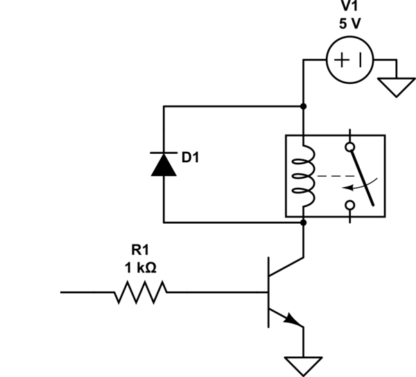
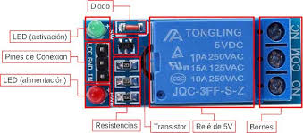
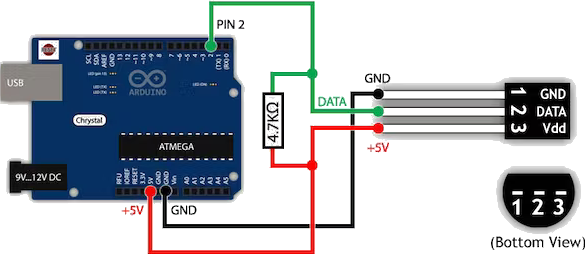
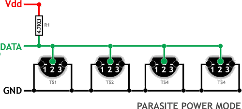

<!--
author: "Pablo Moreira"
theme: default
paginate: true
size: 16:9
footer: "[Link](https://github.com/pablomoreira/arduino_01/blob/main/clase01.md)"
-->

<style>
r { color: Red }
o { color: Orange }
g { color: Green }
</style> 
## **Clase 4 (Actuadores)**
* Relés mecánicos NO/NC
* Circuitos de baja tensión con reles (Lamparas)
* Medición de temperatura digital

---

## **Relé**


El relé es un dispositivo electromagnético. Funciona como un interruptor controlado por un circuito eléctrico en el que, por medio de una bobina y un electro-imán, se acciona un juego de uno o varios contactos que permiten abrir o cerrar otros circuitos eléctricos independientes.

---

## **Modulos para Arduino Relé**



---

## **Esquema**

<p align="center">
  
</p>

---
## **¿Como se utiliza un Rele?**

* Un relé es una salida digital.
* Utilizar un relé es equivalente, en código, a activar o desactivar un LED.

---
```cpp
byte RELE = 2;

void setup() {
  Serial.begin(9600);
  pinMode(LED, OUTPUT);
}

void loop() {
  uint16_t analog0;
  analog0 = analogRead(A0);
  Serial.println(analog0); 
  if(analog0 > 550){
    digitalWrite(RELE, HIGH);
  }
  else{
    digitalWrite(RELE, LOW);
  }
  delay(500);
}
```
---
## **Sensores digitales**
* Son dispositivos que requieren conversion analógica digital.
* Suelen implementer algún protocolo estándar o propio. 
* Es muy probable que exista una biblioteca para utilizar.
* Ejemplo: DS18B20.
---



---

```cpp
// Include the libraries we need
#include <OneWire.h>
#include <DallasTemperature.h>

// Data wire is plugged into port 2 on the Arduino
#define ONE_WIRE_BUS 2

// Setup a oneWire instance to communicate with any OneWire devices (not just Maxim/Dallas temperature ICs)
OneWire oneWire(ONE_WIRE_BUS);

// Pass our oneWire reference to Dallas Temperature.
DallasTemperature sensors(&oneWire);

/*
 * The setup function. We only start the sensors here
 */
void setup(void)
{
  // start serial port
  Serial.begin(9600);
  Serial.println("Dallas Temperature IC Control Library Demo");

  // Start up the library
  sensors.begin();
}

/*
 * Main function, get and show the temperature
 */
void loop(void)
{
  // call sensors.requestTemperatures() to issue a global temperature
  // request to all devices on the bus
  Serial.print("Requesting temperatures...");
  sensors.requestTemperatures(); // Send the command to get temperatures
  Serial.println("DONE");
  // After we got the temperatures, we can print them here.
  // We use the function ByIndex, and as an example get the temperature from the first sensor only.
  float tempC = sensors.getTempCByIndex(0);

  // Check if reading was successful
  if (tempC != DEVICE_DISCONNECTED_C)
  {
    Serial.print("Temperature for the device 1 (index 0) is: ");
    Serial.println(tempC);
  }
  else
  {
    Serial.println("Error: Could not read temperature data");
  }
}
```

---


---

